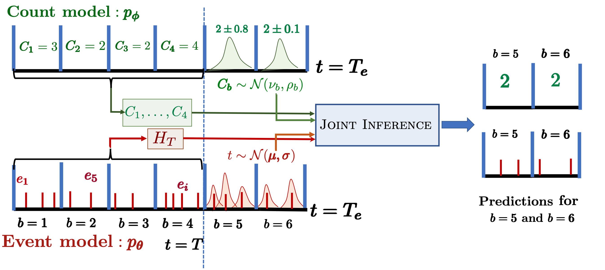

# Long Horizon Forecasting With Temporal Point Processes

This is the code produced as part of the paper _Long Horizon Forecasting With Temporal Point Processes_ 

> "Long Horizon Forecasting With Temporal Point Processes"
> Prathamesh Deshpande, Kamlesh Marathe, Abir De, Sunita Sarawagi. WSDM 2021. [arXiv:2101.02815](https://arxiv.org/abs/2101.02815)

## Packages needed
Specified in [requirements](requirements.txt).

## Dataset Download
We have provided all the datasets used in our experiments [here](https://drive.google.com/drive/folders/1b1KUwkeIqIViPZoRZzbPAzKeNn7P1OD-?usp=sharing).

Please download the `data/` folder add place it in the [DualTPP](https://github.com/pratham16cse/DualTPP) directory.

## Experiment execution
To run the code to reproduce the results, please use this [script](script.sh) \[ Under development, more datasets will be soon added to the script\].

## Output
All the outputs will be stored in the `<output_dir>` directory.

The numbers reported in Table 2 of the [paper](https://arxiv.org/abs/2101.02815) will be stored in `output_dir/results_<dataset_name>.json` and `output_dir/results_<dataset_name>.txt` files.

## Parameters Description
Under Development

## Contact
For any queries related to library versions, datasets, script, and results please contact us here:

Email: prathameshsdeshpande@gmail.com

Whatsapp: +91 9043751980
